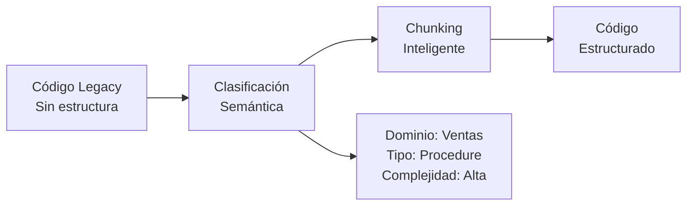
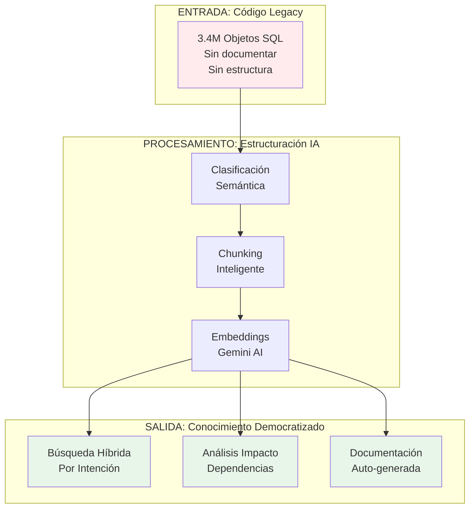

# 🎯 SQUIT - "SQL Quit"
## Democratizando Código Legacy con IA

[](https://www.python.org/downloads/)
[](https://cloud.google.com/bigquery)
[](https://ai.google.dev/)
[](https://www.docker.com/)
[](docs/MEMORY_OPTIMIZATION.md)
[](LICENSE)

> **"SQL Quit"** - Libérate del código SQL críptico y mal documentado.  
> Democratiza el acceso al conocimiento enterrado en millones de líneas de código legacy.

**SQUIT** transforma el caos del código SQL legacy en conocimiento estructurado y accesible mediante IA. Ordena, estructura y hace comprensible lo incomprensible a través de búsqueda híbrida semántica.

---

## 💡 El Problema que Resolvemos

### El Reto del Código Legacy

Organizaciones con **décadas de desarrollo SQL** enfrentan:

- 📚 **Millones de líneas** de código sin documentar
- 🔍 **Conocimiento tribal** en cabezas de desarrolladores veteranos
- 🌀 **Lógica de negocio enterrada** en procedimientos de 10K+ líneas
- ⏰ **Horas perdidas** buscando "dónde está implementado X"
- 🚫 **Barreras de entrada** para nuevos desarrolladores
- 💸 **Riesgo de cambios** por dependencias invisibles

### La Solución: Democratización con IA

**SQUIT** democratiza el acceso al conocimiento legacy mediante:

1. **🏗️ Estructuración Inteligente**: Ordena el caos con clasificación semántica automática
2. **🔍 Búsqueda Híbrida**: Encuentra código por intención, no por texto exacto
3. **🤖 Comprensión con IA**: Entiende qué hace el código y por qué
4. **🎯 Democratización**: Cualquiera puede entender el codebase, no solo expertos

---

## 🚀 ¿Qué es SQUIT?

**"SQL Quit"** = Libérate del SQL incomprensible

SQUIT transforma código SQL legacy en:
- ✅ **Código estructurado** y clasificado semánticamente
- ✅ **Base de conocimiento** buscable por intención
- ✅ **Documentación viva** generada automáticamente
- ✅ **Análisis de impacto** para cambios seguros
- ✅ **Onboarding acelerado** para nuevos desarrolladores

### Tecnología

Sistema de búsqueda vectorial híbrida 100% en BigQuery con:
- **Embeddings semánticos**: Gemini AI (768 dimensiones)
- **Chunking inteligente**: Divide lógicamente según complejidad
- **Clasificación automática**: Identifica patrones y dominios de negocio
- **Búsqueda híbrida**: 70% semántica + 30% keywords
- **Memoria multi-turn**: Conversaciones contextuales con Google ADK Sessions
- **Context Caching**: Reduce latencia 50% (Gemini)
- **Few-Shot Learning**: Ejemplos dinámicos desde historial BigQuery

---

## 🎯 Casos de Uso: Democratizando el Legacy

### 1. 🔍 **"¿Dónde está implementada la lógica de X?"**

**Antes (tradicional):**
```sql
-- Buscar texto exacto en 3.4M objetos
-- ❌ Solo encuentra matches exactos
-- ❌ No entiende sinónimos o intención
-- ❌ Requiere conocer términos técnicos específicos
```

**Después (SQUIT):**
```python
# Búsqueda por intención en lenguaje natural
results = search.semantic_search(
    "autenticación de usuarios con validación de permisos"
)
# ✅ Encuentra lógica relacionada aunque use términos diferentes
# ✅ Entiende contexto y sinónimos
# ✅ No requiere conocimiento previo del codebase
```

### 2. 📊 **"¿Qué hace este procedimiento y para qué sirve?"**

**Antes:** Leer 5,000 líneas de código sin comentarios

**Después:** 
```
Procedimiento: sp_ActualizarInventarioMaestro
Dominio: Inventario
Complejidad: Alta (8.5/10)
Resumen: Sincroniza movimientos de inventario entre almacenes,
         aplicando reglas de negocio para transferencias y ajustes.
         Valida existencias, genera logs de auditoría y notifica
         discrepancias.
Depende de: 12 tablas, 3 procedimientos
Usado por: 8 procesos batch, 2 aplicaciones web
```

### 3. 🔗 **"¿Qué se rompe si modifico esta tabla?"**

**Antes:** Buscar manualmente referencias en código

**Después:** Análisis de impacto automático
```
Tabla: ClientesMaster
├─ Leída por: 45 procedimientos, 12 vistas
├─ Modificada por: 8 procedimientos
├─ Dependencias críticas:
│  ├─ Sistema de facturación (ALTO RIESGO)
│  ├─ Portal de clientes (MEDIO RIESGO)
│  └─ Reportes ejecutivos (BAJO RIESGO)
└─ Recomendación: Revisar sp_ProcesarFacturacion antes de cambios
```

### 4. 🎓 **Onboarding: "Quiero entender el sistema"**

**Antes:** Semanas de lectura de código + preguntas a expertos

**Después:**
- 🗺️ Mapa automático del codebase por dominios
- 📚 Patrones comunes identificados y documentados
- 🎯 Puntos críticos y componentes clave destacados
- 💡 Ejemplos de uso real extraídos del código

### 5. 🔄 **Modernización: "¿Qué refactorizar primero?"**

**Antes:** Intuición y experiencia personal

**Después:** Análisis objetivo
```
Objetos de alta complejidad sin documentación:
1. sp_CalculoNominaMensual (Complejidad: 9.2, 0 comentarios)
   └─ Usado por: Sistema de nómina (CRÍTICO)
   
2. fn_ValidacionReglasFiscales (Complejidad: 8.7, 0 comentarios)
   └─ Usado por: 15 procedimientos (ALTO USO)

Recomendación: Priorizar documentación y refactoring
```

---

## ⚡ Quick Start: Democratiza tu Legacy en 3 Pasos

### Paso 1: Configuración (5 minutos)

```bash
# Clonar y configurar
git clone https://github.com/deacero/squit.git
cd squit
cp env.example .env

# Editar .env con tus credenciales:
# - GOOGLE_CLOUD_PROJECT (BigQuery con tu código SQL)
# - GEMINI_API_KEY (para embeddings semánticos)
```

### Paso 2: Estructurar el Legacy (3-5 horas una sola vez)

```bash
# Pipeline completo: Chunking + Embeddings + Índice Vectorial
python scripts/run_bigquery_pipeline.py

# El sistema automáticamente:
# ✅ Clasifica objetos por tipo y dominio
# ✅ Divide código complejo en chunks comprensibles
# ✅ Genera embeddings semánticos con IA
# ✅ Crea índice de búsqueda híbrida
```

### Paso 3: Libérate del SQL Críptico

#### 🤖 CLI Conversacional (Recomendado)

```bash
# Asistente inteligente con memoria multi-turn
python scripts/squit.py

squit[1]> explicame kayak, cuales son los principales store procedures
# Obtiene respuesta completa con contexto...

squit[2]> este procedimiento en particular AgAsignaFechasKayakProc, que hace
# ✅ Entiende "este procedimiento" por contexto del turno anterior

squit[3]> reset  # Limpia memoria y empieza nueva conversación
```

**Features:**
- ✅ **Memoria de conversación**: Referencias contextuales ("este", "el primero", etc.)
- ✅ **Multi-turn natural**: Como hablar con un experto
- ✅ **Reset bajo demanda**: `reset` para nueva conversación

#### 🔍 Búsqueda Tradicional

```bash
# Búsqueda interactiva por intención
python scripts/bigquery_search_chunks.py interactive

# Análisis del codebase
python scripts/bigquery_search_chunks.py patterns
```

#### 📚 API Python
```python
from bigquery_vector.vector_search import BigQueryVectorSearch

search = BigQueryVectorSearch()

# "¿Dónde están los cálculos de facturación?"
results = search.semantic_search(
    "cálculos de facturación impuestos y descuentos",
    business_domains=["ventas", "finanzas"]
)

# "¿Qué procedimientos manejan inventario?"
results = search.search_by_functionality("inventario")

# "¿Código similar a este procedimiento?"
similar = search.find_similar_objects(object_id="chunk_id_123")
```

---

## 📦 Preparar tu Código Legacy para SQUIT

Antes de democratizar tu código, necesitas **extraerlo y cargarlo en BigQuery**. Esta es una tarea **una sola vez** que prepara todo para el análisis con IA.

### Contrato de Datos: Schema Requerido

SQUIT requiere que tu código SQL esté en BigQuery en esta tabla:

```sql
CREATE TABLE `tu-proyecto.tu_dataset.sql_objects_code` (
    -- Identificadores del objeto
    server STRING NOT NULL,              -- Servidor origen (ej: SRVDB01\INSTANCIA)
    database STRING NOT NULL,            -- Base de datos (ej: ProduccionDB)
    schema STRING,                       -- Schema (ej: dbo, opcional)
    object_name STRING NOT NULL,         -- Nombre del objeto (ej: sp_ProcesarVentas)
    object_type STRING NOT NULL,         -- Tipo: PROCEDURE, VIEW, FUNCTION, TRIGGER, TABLE
    
    -- Código fuente
    sql_code STRING NOT NULL,            -- Código SQL completo del objeto
    
    -- Metadatos de tracking
    content_hash STRING,                 -- MD5 del código (para detectar cambios)
    last_modified TIMESTAMP,             -- Última modificación del objeto
    created_at TIMESTAMP DEFAULT CURRENT_TIMESTAMP(),  -- Cuándo se ingresó a SQUIT
    
    -- Metadatos opcionales (pero recomendados)
    row_count INT64,                     -- Número de líneas de código
    size_bytes INT64,                    -- Tamaño en bytes
    dependencies STRING,                 -- Dependencias (formato JSON)
    description STRING,                  -- Descripción si existe
    owner STRING                         -- Creador/dueño del objeto
);
```

### Paso 1: Extraer Código de SQL Server

Si tu código está en **SQL Server**, usa este script para extraerlo:

```sql
-- Script para SQL Server: Extraer todos los objetos con su código
-- Ejecuta en cada base de datos que quieras democratizar

SELECT 
    @@SERVERNAME as server,
    DB_NAME() as database,
    SCHEMA_NAME(o.schema_id) as schema,
    o.name as object_name,
    o.type_desc as object_type,
    
    -- Obtener código fuente
    OBJECT_DEFINITION(o.object_id) as sql_code,
    
    -- Metadatos de tracking
    CONVERT(VARCHAR(32), HASHBYTES('MD5', OBJECT_DEFINITION(o.object_id)), 2) as content_hash,
    o.modify_date as last_modified,
    GETDATE() as created_at,
    
    -- Metadatos opcionales
    (SELECT COUNT(*) FROM STRING_SPLIT(OBJECT_DEFINITION(o.object_id), CHAR(10))) as row_count,
    DATALENGTH(OBJECT_DEFINITION(o.object_id)) as size_bytes,
    NULL as dependencies,  -- Se puede extraer con sys.sql_expression_dependencies
    NULL as description,
    USER_NAME(o.principal_id) as owner

FROM sys.objects o
WHERE o.type IN (
    'P',   -- Procedimientos almacenados
    'FN',  -- Funciones escalares
    'IF',  -- Funciones inline table-valued
    'TF',  -- Funciones table-valued
    'V',   -- Vistas
    'TR'   -- Triggers
)
AND OBJECT_DEFINITION(o.object_id) IS NOT NULL  -- Solo objetos con código accesible
AND o.is_ms_shipped = 0  -- Excluir objetos del sistema

ORDER BY o.type_desc, o.name;
```

**Ejecutar en múltiples bases de datos:**

```sql
-- Script para iterar todas las bases de datos en un servidor
DECLARE @sql NVARCHAR(MAX);
DECLARE @database NVARCHAR(128);

DECLARE db_cursor CURSOR FOR 
    SELECT name 
    FROM sys.databases 
    WHERE state = 0  -- Solo bases online
    AND name NOT IN ('master', 'tempdb', 'model', 'msdb')  -- Excluir del sistema
    ORDER BY name;

CREATE TABLE #AllSQLObjects (
    server NVARCHAR(128),
    database_name NVARCHAR(128),
    schema_name NVARCHAR(128),
    object_name NVARCHAR(256),
    object_type NVARCHAR(60),
    sql_code NVARCHAR(MAX),
    content_hash VARCHAR(32),
    last_modified DATETIME,
    created_at DATETIME,
    row_count INT,
    size_bytes INT,
    owner NVARCHAR(128)
);

OPEN db_cursor;
FETCH NEXT FROM db_cursor INTO @database;

WHILE @@FETCH_STATUS = 0
BEGIN
    SET @sql = N'USE [' + @database + N'];
    INSERT INTO #AllSQLObjects
    SELECT 
        @@SERVERNAME,
        DB_NAME(),
        SCHEMA_NAME(o.schema_id),
        o.name,
        o.type_desc,
        OBJECT_DEFINITION(o.object_id),
        CONVERT(VARCHAR(32), HASHBYTES(''MD5'', OBJECT_DEFINITION(o.object_id)), 2),
        o.modify_date,
        GETDATE(),
        (SELECT COUNT(*) FROM STRING_SPLIT(OBJECT_DEFINITION(o.object_id), CHAR(10))),
        DATALENGTH(OBJECT_DEFINITION(o.object_id)),
        USER_NAME(o.principal_id)
    FROM sys.objects o
    WHERE o.type IN (''P'', ''FN'', ''IF'', ''TF'', ''V'', ''TR'')
    AND OBJECT_DEFINITION(o.object_id) IS NOT NULL
    AND o.is_ms_shipped = 0;';
    
    EXEC sp_executesql @sql;
    FETCH NEXT FROM db_cursor INTO @database;
END;

CLOSE db_cursor;
DEALLOCATE db_cursor;

-- Exportar resultados
SELECT * FROM #AllSQLObjects ORDER BY database_name, object_type, object_name;

DROP TABLE #AllSQLObjects;
```

### Paso 2: Cargar a BigQuery

Una vez extraídos los datos, cárgalos a BigQuery:

**Opción A: CSV/JSON Export + bq load**

```bash
# 1. Exportar desde SQL Server a CSV
# Desde SSMS o sqlcmd, exportar los resultados a archivo

# 2. Cargar a BigQuery
bq load \
  --source_format=CSV \
  --skip_leading_rows=1 \
  --allow_quoted_newlines \
  --allow_jagged_rows \
  tu-proyecto:tu_dataset.sql_objects_code \
  sql_objects_export.csv \
  server:STRING,database:STRING,schema:STRING,object_name:STRING,object_type:STRING,sql_code:STRING,content_hash:STRING,last_modified:TIMESTAMP,created_at:TIMESTAMP,row_count:INTEGER,size_bytes:INTEGER,owner:STRING
```

**Opción B: Script Python Automatizado**

```python
# extract_and_load.py - Script para automatizar todo el proceso

import pyodbc
from google.cloud import bigquery
import hashlib
from datetime import datetime

# Configuración SQL Server
SQL_SERVERS = [
    {"host": "SERVER1\\INSTANCE", "databases": ["DB1", "DB2"]},
    {"host": "SERVER2", "databases": ["DB3", "DB4"]},
]

# Configuración BigQuery
BQ_PROJECT = "tu-proyecto"
BQ_DATASET = "tu_dataset"
BQ_TABLE = "sql_objects_code"

def extract_from_sql_server(server, database):
    """Extrae objetos SQL de un servidor."""
    conn_str = f"DRIVER={{ODBC Driver 17 for SQL Server}};SERVER={server};DATABASE={database};Trusted_Connection=yes"
    conn = pyodbc.connect(conn_str)
    cursor = conn.cursor()
    
    query = """
    SELECT 
        @@SERVERNAME as server,
        DB_NAME() as database,
        SCHEMA_NAME(o.schema_id) as schema,
        o.name as object_name,
        o.type_desc as object_type,
        OBJECT_DEFINITION(o.object_id) as sql_code,
        o.modify_date as last_modified
    FROM sys.objects o
    WHERE o.type IN ('P', 'FN', 'IF', 'TF', 'V', 'TR')
    AND OBJECT_DEFINITION(o.object_id) IS NOT NULL
    AND o.is_ms_shipped = 0
    """
    
    objects = []
    for row in cursor.execute(query):
        objects.append({
            "server": row.server,
            "database": row.database,
            "schema": row.schema,
            "object_name": row.object_name,
            "object_type": row.object_type,
            "sql_code": row.sql_code,
            "content_hash": hashlib.md5(row.sql_code.encode()).hexdigest(),
            "last_modified": row.last_modified,
            "created_at": datetime.now(),
            "row_count": row.sql_code.count('\n') if row.sql_code else 0,
            "size_bytes": len(row.sql_code.encode()) if row.sql_code else 0
        })
    
    conn.close()
    return objects

def load_to_bigquery(objects):
    """Carga objetos a BigQuery."""
    client = bigquery.Client(project=BQ_PROJECT)
    table_id = f"{BQ_PROJECT}.{BQ_DATASET}.{BQ_TABLE}"
    
    # Configurar el job
    job_config = bigquery.LoadJobConfig(
        write_disposition="WRITE_APPEND",  # Agregar a tabla existente
        schema=[
            bigquery.SchemaField("server", "STRING", mode="REQUIRED"),
            bigquery.SchemaField("database", "STRING", mode="REQUIRED"),
            bigquery.SchemaField("schema", "STRING"),
            bigquery.SchemaField("object_name", "STRING", mode="REQUIRED"),
            bigquery.SchemaField("object_type", "STRING", mode="REQUIRED"),
            bigquery.SchemaField("sql_code", "STRING", mode="REQUIRED"),
            bigquery.SchemaField("content_hash", "STRING"),
            bigquery.SchemaField("last_modified", "TIMESTAMP"),
            bigquery.SchemaField("created_at", "TIMESTAMP"),
            bigquery.SchemaField("row_count", "INTEGER"),
            bigquery.SchemaField("size_bytes", "INTEGER"),
        ],
    )
    
    # Cargar datos
    job = client.load_table_from_json(objects, table_id, job_config=job_config)
    job.result()  # Esperar a que complete
    
    print(f"✅ Cargados {len(objects)} objetos a {table_id}")

# Ejecutar extracción y carga
all_objects = []
for server_config in SQL_SERVERS:
    for database in server_config["databases"]:
        print(f"Extrayendo {server_config['host']}.{database}...")
        objects = extract_from_sql_server(server_config["host"], database)
        all_objects.extend(objects)
        print(f"  → {len(objects)} objetos extraídos")

print(f"\nTotal objetos extraídos: {len(all_objects)}")
print("Cargando a BigQuery...")
load_to_bigquery(all_objects)
print("✅ ¡Proceso completado!")
```

**Ejecutar el script:**

```bash
# Instalar dependencias
pip install pyodbc google-cloud-bigquery

# Ejecutar
python extract_and_load.py
```

### Paso 3: Validar la Carga

```sql
-- Verificar que los datos se cargaron correctamente
SELECT 
    COUNT(*) as total_objects,
    COUNT(DISTINCT server) as servers,
    COUNT(DISTINCT database) as databases,
    object_type,
    COUNT(*) as count_by_type
FROM `tu-proyecto.tu_dataset.sql_objects_code`
GROUP BY object_type
ORDER BY count_by_type DESC;

-- Ver muestra de datos
SELECT 
    server,
    database,
    object_name,
    object_type,
    LENGTH(sql_code) as code_length,
    last_modified
FROM `tu-proyecto.tu_dataset.sql_objects_code`
LIMIT 10;
```

### Paso 4: Configurar SQUIT

Una vez cargados los datos, configura SQUIT para usarlos:

```bash
# .env
GOOGLE_CLOUD_PROJECT=tu-proyecto
BIGQUERY_DATASET=tu_dataset
BIGQUERY_SOURCE_TABLE=sql_objects_code
GEMINI_API_KEY=tu-gemini-key
```

### Paso 5: ¡Democratiza!

```bash
# Ejecutar el pipeline de estructuración
python scripts/run_bigquery_pipeline.py

# Monitorear progreso
python scripts/monitor_pipeline.py
```

### 🎯 Extracción desde Otros Sistemas

#### MySQL/MariaDB

```sql
SELECT 
    @@hostname as server,
    DATABASE() as database,
    ROUTINE_SCHEMA as schema,
    ROUTINE_NAME as object_name,
    ROUTINE_TYPE as object_type,
    ROUTINE_DEFINITION as sql_code,
    MD5(ROUTINE_DEFINITION) as content_hash,
    LAST_ALTERED as last_modified
FROM information_schema.ROUTINES
WHERE ROUTINE_SCHEMA NOT IN ('mysql', 'information_schema', 'performance_schema', 'sys');
```

#### PostgreSQL

```sql
SELECT 
    current_database() as server,
    current_database() as database,
    n.nspname as schema,
    p.proname as object_name,
    CASE p.prokind
        WHEN 'f' THEN 'FUNCTION'
        WHEN 'p' THEN 'PROCEDURE'
        WHEN 'a' THEN 'AGGREGATE'
        WHEN 'w' THEN 'WINDOW'
    END as object_type,
    pg_get_functiondef(p.oid) as sql_code,
    md5(pg_get_functiondef(p.oid)) as content_hash,
    NOW() as last_modified
FROM pg_proc p
JOIN pg_namespace n ON p.pronamespace = n.oid
WHERE n.nspname NOT IN ('pg_catalog', 'information_schema')
AND pg_get_functiondef(p.oid) IS NOT NULL;
```

#### Oracle

```sql
SELECT 
    SYS_CONTEXT('USERENV', 'SERVER_HOST') as server,
    SYS_CONTEXT('USERENV', 'DB_NAME') as database,
    owner as schema,
    object_name,
    object_type,
    DBMS_METADATA.GET_DDL(object_type, object_name, owner) as sql_code,
    STANDARD_HASH(DBMS_METADATA.GET_DDL(object_type, object_name, owner), 'MD5') as content_hash,
    last_ddl_time as last_modified
FROM dba_objects
WHERE object_type IN ('PROCEDURE', 'FUNCTION', 'PACKAGE', 'PACKAGE BODY', 'TRIGGER', 'VIEW')
AND owner NOT IN ('SYS', 'SYSTEM', 'OUTLN', 'DBSNMP')
ORDER BY owner, object_type, object_name;
```

### 📋 Checklist de Preparación

- [ ] Identificar servidores y bases de datos con código legacy
- [ ] Ejecutar scripts de extracción en cada servidor
- [ ] Consolidar datos en formato CSV/JSON
- [ ] Crear tabla `sql_objects_code` en BigQuery
- [ ] Cargar datos extraídos
- [ ] Validar conteo y calidad de datos
- [ ] Configurar `.env` con project/dataset correctos
- [ ] Ejecutar `python scripts/run_bigquery_pipeline.py --validate`
- [ ] ¡Democratizar con `run_bigquery_pipeline.py`!

### 💡 Tips para Extracción

1. **Incremental**: Guarda `content_hash` para detectar cambios y re-procesar solo lo modificado
2. **Batches**: Si tienes muchos servidores, procesa por lotes
3. **Scheduling**: Configura extracción automática (ej: semanal) para mantener actualizado
4. **Filtrado**: Empieza con bases de datos críticas, expande gradualmente
5. **Testing**: Prueba primero con 1-2 bases pequeñas antes de todo

---

## 🧠 Cómo Funciona: De Caos a Conocimiento

### 1️⃣ **Ingestión**: Tu código SQL legacy entra

```
Entrada: 3.4M objetos SQL
├─ 275 servidores SQL Server
├─ Procedimientos, vistas, funciones, triggers
└─ Décadas de desarrollo acumulado
```

### 2️⃣ **Estructuración**: Orden del caos



**Clasificación automática:**
- 🏢 **7 dominios de negocio**: ventas, inventario, finanzas, producción, etc.
- 📋 **8 tipos semánticos**: procedures, views, functions, queries complejas, etc.
- 📊 **Scores de complejidad**: Identifica código crítico que requiere atención

**Chunking inteligente:**
- 📦 Divide procedimientos de 10K líneas en chunks comprensibles
- 🔗 Mantiene contexto con traslape del 20%
- 🎯 4 estrategias según complejidad (15K, 50K, 1M, >1M caracteres)

### 3️⃣ **Comprensión**: IA entiende el código

```
Para cada chunk:
├─ Embedding semántico (768 dimensiones)
├─ Identificación de dependencias
├─ Extracción de lógica de negocio
└─ Generación de resumen comprensible
```

### 4️⃣ **Democratización**: Búsqueda accesible

```python
# Pregunta en lenguaje natural
"procedimientos que calculan comisiones de vendedores"

# IA traduce a búsqueda híbrida:
# 70% Búsqueda vectorial semántica
# 30% Keywords tradicionales

# Retorna: código relevante + contexto + explicación
```

---

## 🎯 Arquitectura: Democratización a Escala



### Tecnología Subyacente

| Componente | Tecnología | Por qué |
|------------|------------|---------|
| **Storage** | BigQuery | Escala a millones de objetos |
| **Embeddings** | Gemini AI (768D) | Comprende semántica del código |
| **Chunking** | SQL nativo | 10x más rápido que Python |
| **Búsqueda** | Vector Search híbrida | Precisión + recall óptimos |
| **Tracking** | BigQuery tables | Observabilidad completa |

---

## 💻 Ejemplos de Uso: Democratización en Acción

### Desarrollador Nuevo: "No entiendo nada de este código"

```python
from bigquery_vector.vector_search import BigQueryVectorSearch

search = BigQueryVectorSearch()

# Entender el dominio de ventas
ventas = search.semantic_search(
    "procesos de venta facturación y cobro",
    business_domains=["ventas"],
    limit=20
)

print(f"Encontrados {len(ventas)} componentes de ventas")
for obj in ventas:
    print(f"- {obj['object_name']}: {obj['semantic_summary']}")
```

### Arquitecto: "Necesito mapear dependencias"

```python
# Analizar impacto de cambio en tabla
cliente_deps = search.semantic_search(
    "ClientesMaster tabla lectura escritura",
    limit=50
)

# Agrupar por tipo de uso
lecturas = [d for d in cliente_deps if 'SELECT' in d['semantic_tags']]
escrituras = [d for d in cliente_deps if 'INSERT' in d['semantic_tags']]

print(f"Impacto de modificar ClientesMaster:")
print(f"  Lecturas: {len(lecturas)} objetos")
print(f"  Escrituras: {len(escrituras)} objetos")
```

### Manager: "¿Qué tan complejo es modernizar?"

```python
# Obtener análisis de complejidad
patterns = search.analyze_codebase_patterns()

# Identificar código de alta complejidad
complex = [p for p in patterns['complex_objects'] 
           if p['max_complexity'] > 8.0]

print("Objetos críticos para modernización:")
for obj in complex:
    print(f"  {obj['object_name']}: Complejidad {obj['max_complexity']}")
    print(f"    Dominio: {obj['business_domain']}")
    print(f"    Chunks: {obj['chunks_count']}")
```

---

## 📊 Resultados: El Impacto de Democratizar

### Métricas de Democratización

| Métrica | Antes | Después | Mejora |
|---------|-------|---------|--------|
| **Tiempo para encontrar lógica** | 2-4 horas | < 2 minutos | **60-120x** |
| **Onboarding nuevo dev** | 3-6 meses | 2-4 semanas | **6-12x** |
| **Identificar dependencias** | Manual, días | Automático, segundos | **∞x** |
| **Documentación actualizada** | Desactualizada | Auto-generada | **100%** |
| **Acceso al conocimiento** | 5-10 expertos | Toda la organización | **Democratizado** |

### Casos Reales

> **"Antes:** Pasábamos semanas buscando dónde estaba implementada una regla de negocio.  
> **Después:** SQUIT nos lo muestra en segundos, con contexto y dependencias."  
> — *Lead Developer, Empresa con 20 años de SQL legacy*

> **"El onboarding que tomaba 4 meses ahora toma 3 semanas. Los nuevos desarrolladores pueden contribuir desde el día uno."**  
> — *Engineering Manager*

---

## 🏗️ Estructura del Proyecto

```
squit/
├── app/
│   ├── bigquery_vector/       # 🎯 Motor de democratización
│   │   ├── config.py          # Configuración
│   │   ├── chunking_pipeline.py   # Estructuración inteligente
│   │   ├── vector_search.py   # Búsqueda híbrida
│   │   └── progress_tracker.py    # Observabilidad
│   ├── agentic_rag/           # 🤖 Análisis inteligente
│   └── squit_client/          # 📦 Cliente BigQuery
├── scripts/
│   ├── run_bigquery_pipeline.py   # Ejecutor del pipeline
│   ├── monitor_pipeline.py    # Monitor en tiempo real
│   └── bigquery_search_chunks.py  # CLI de búsqueda
├── docs/
│   ├── BIGQUERY_VECTOR_COMPLETE.md  # Documentación técnica
│   └── SYSTEM_OVERVIEW.md     # Overview ejecutivo
└── README.md                  # Este archivo
```

---

## 🚀 Scripts: Democratizando tu Legacy

### Pipeline de Estructuración

```bash
# Estructurar código legacy completo
python scripts/run_bigquery_pipeline.py

# Validar antes de ejecutar
python scripts/run_bigquery_pipeline.py --validate

# Monitorear progreso en tiempo real
python scripts/monitor_pipeline.py
```

### Búsqueda y Análisis

```bash
# Demo de búsquedas semánticas
python scripts/bigquery_search_chunks.py demo

# Modo interactivo: pregunta libremente
python scripts/bigquery_search_chunks.py interactive

# Analizar patrones del codebase
python scripts/bigquery_search_chunks.py patterns
```

---

## 🎓 Guías y Documentación

### Para Comenzar
- **[Quick Start](#-quick-start-democratiza-tu-legacy-en-3-pasos)**: Democratiza en 15 minutos
- **[Casos de Uso](#-casos-de-uso-democratizando-el-legacy)**: Problemas que resolvemos

### Documentación Técnica
- **[Documentación Completa](docs/BIGQUERY_VECTOR_COMPLETE.md)**: 500+ líneas de detalles técnicos
- **[System Overview](docs/SYSTEM_OVERVIEW.md)**: Arquitectura ejecutiva
- **[API Reference](docs/API.md)**: Referencia de APIs

### Para Contribuir
- **[Contributing Guide](CONTRIBUTING.md)**: Cómo contribuir
- **[README.yml](README.yml)**: Contexto para Cursor AI
- **[.cursorrules](.cursorrules)**: Reglas del proyecto

---

## 🔧 Configuración

### Variables de Ambiente

```bash
# Google Cloud Platform (donde está tu código SQL)
GOOGLE_CLOUD_PROJECT=tu-proyecto
GOOGLE_APPLICATION_CREDENTIALS=./credentials.json

# Gemini API (para embeddings semánticos)
GEMINI_API_KEY=tu-api-key

# BigQuery (tu código legacy)
BIGQUERY_DATASET=tu_codigo_sql
BIGQUERY_SOURCE_TABLE=sql_objects_code
```

### Dataset de Entrada

Tu código SQL debe estar en una tabla BigQuery con:
```sql
CREATE TABLE sql_objects_code (
    server STRING,              -- Servidor origen
    database STRING,            -- Base de datos
    schema STRING,              -- Schema
    object_name STRING,         -- Nombre del objeto
    object_type STRING,         -- PROCEDURE, VIEW, FUNCTION, etc.
    sql_code STRING,            -- Código SQL completo
    content_hash STRING,        -- Hash para tracking
    last_modified TIMESTAMP     -- Última modificación
);
```

---

## 🤝 Comunidad: Democratización Colaborativa

### Comparte tu Experiencia

¿Usaste SQUIT para democratizar tu código legacy? **¡Cuéntanos!**

- 📧 Email: ktouma@deacero.com
- 💬 Discussions: GitHub Discussions
- 🐛 Issues: Reporta bugs o solicita features

### Contribuye

Ayúdanos a democratizar más código legacy:

1. 🍴 Fork del proyecto
2. 🌿 Crea feature branch
3. ✅ Aplica estándares: `make format && make lint`
4. 📝 Commit descriptivo
5. 🚀 Pull Request

Ver [CONTRIBUTING.md](CONTRIBUTING.md) para más detalles.

---

## 📄 Licencia

MIT License - Ver [LICENSE](LICENSE)

---

## 💡 Filosofía: "SQL Quit"

### Por qué "SQL Quit"

**Quit** = Salir, liberarse, dejar atrás

- 🚪 **Sal** del código incomprensible
- 🔓 **Libérate** de la dependencia de expertos
- 🎯 **Deja atrás** el conocimiento tribal
- 🌟 **Democratiza** el acceso al conocimiento

### Nuestra Visión

> **El código legacy no debería ser una barrera.**  
> Debería ser **conocimiento accesible** para toda la organización.

Creemos que:
- 🌍 El conocimiento del código debe estar **democratizado**
- 🤖 La IA puede hacer el código legacy **comprensible**
- 🔍 La búsqueda debe ser por **intención**, no por sintaxis
- 📚 La documentación debe **generarse automáticamente**
- 🎓 El onboarding debe ser **semanas, no meses**

### Únete al Movimiento

**Democratiza tu código legacy. Libera el conocimiento. SQL Quit.**

---

<div align="center">

**🎯 SQUIT - "SQL Quit"**

*Democratizando código legacy con IA*

[](https://www.python.org/)
[](https://cloud.google.com/bigquery)
[](https://ai.google.dev/)

**[Quick Start](#-quick-start-democratiza-tu-legacy-en-3-pasos)** • 
**[Documentación](docs/)** • 
**[Contribuir](CONTRIBUTING.md)** • 
**[Comunidad](https://github.com/grupodeacero/squit/discussions)**

*Desarrollado por Grupo DeAcero*  
*Con ❤️ y el deseo de democratizar el conocimiento*

</div>